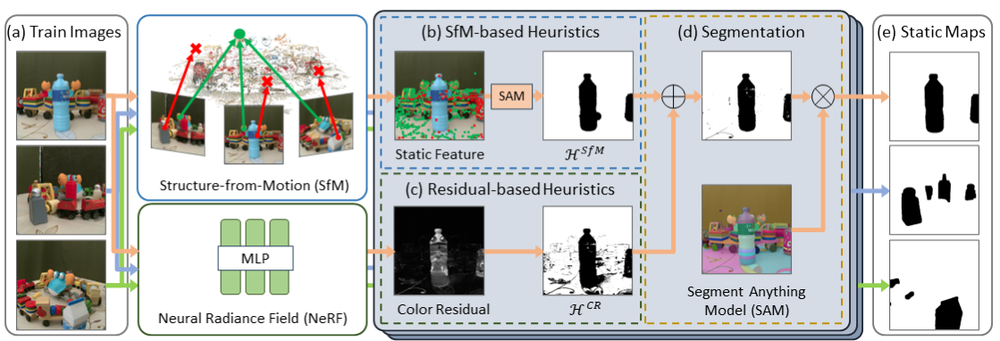

# NeRF-HuGS: Improved Neural Radiance Fields in Non-static Scenes Using Heuristics-Guided Segmentation

[Jiahao Chen](https://cnhaox.github.io), [Yipeng Qin](https://yipengqin.github.io), [Lingjie Liu](https://lingjie0206.github.io), [Jiangbo lu](https://sites.google.com/site/jiangbolu), [Guanbin Li](http://guanbinli.com)

[[`Paper`](https://arxiv.org/abs/2403.17537)] [[`Project`](https://cnhaox.github.io/NeRF-HuGS/)] [[`Data`](https://drive.google.com/drive/folders/19xmJGgL4VlqviXIDdiy-tLzthu6SJrzn?usp=sharing)] [[`BibTeX`](#Citation)]

> **Abstract**: 
> Neural Radiance Field (NeRF) has been widely recognized for its excellence in novel view synthesis and 3D scene reconstruction. 
> However, their effectiveness is inherently tied to the assumption of static scenes, rendering them susceptible to undesirable artifacts when confronted with transient distractors such as moving objects or shadows. 
> In this work, we propose a novel paradigm, namely "Heuristics-Guided Segmentation" (HuGS), which significantly enhances the separation of static scenes from transient distractors by harmoniously combining the strengths of hand-crafted heuristics and state-of-the-art segmentation models, thus significantly transcending the limitations of previous solutions. 
> Furthermore, we delve into the meticulous design of heuristics, introducing a seamless fusion of Structure-from-Motion (SfM)-based heuristics and color residual heuristics, catering to a diverse range of texture profiles. 
> Extensive experiments demonstrate the superiority and robustness of our method in mitigating transient distractors for NeRFs trained in non-static scenes. 



## Introduction

This repository contains the code release for **CVPR 2024 (Oral)** paper "NeRF-HuGS: Improved Neural Radiance Fields in Non-static Scenes Using Heuristics-Guided Segmentation".

The codebase mainly consists of three parts:

1. `Mip-NeRF 360`: A fork of the official [MultiNeRF](https://github.com/google-research/multinerf). It has been simplified by removing Ref-NeRF and RawNeRF.
2. `nerfacto`: A re-implementation of Nerfacto and vanilla NeRF referring to the official [nerfstudio](https://github.com/nerfstudio-project/nerfstudio) w/o the pose optimization. 
3. `HuGS`: An implementation of Heuristics-Guided Segmentation based on [COLMAP](https://colmap.github.io/) and [Segment Anything](https://segment-anything.com/).

We also provide related data in [Google Drive](https://drive.google.com/drive/folders/19xmJGgL4VlqviXIDdiy-tLzthu6SJrzn?usp=sharing), including five parts:

1. `chekpoints`: Our model weights of Mip-NeRF 360 (base, w/ RobustNeRF, w/ HuGS) and Nerfacto (base, w/ HuGS). You can use these checkpoints to reproduce our results shown in the paper.
2. `rendering_results`: Our rendering results using `chekpoints`. You can use these images to verify our quantitative metrics shown in the paper.
3. `segmentation_results`: Our segmentation results using HuGS on three datasets, including generated static masks for all images and visualizations of the segmentation process for example images (not all images due to limited drive capacity).
4. `distractor_split_files`: Unofficial train/test split files that we use on the Distractor dataset.
5. `kubric_colmap`: COLMAP results of the Kubric dataset that we use for HuGS.

## Setup

### Environment

In this project, we need **two conda environments**:
1. one with [JAX](https://jax.readthedocs.io/) for `Mip-NeRF 360`;
2. one with [PyTorch](https://pytorch.org/) for `Nerfacto`, `HuGS` and `metrics.py`.

Here's an example of creating environments using GPU with CUDA 11.8.
```bash
# 1. Clone the repo.
git clone https://github.com/cnhaox/NeRF-HuGS --recursive
cd NeRF-HuGS

# 2. Make a conda environment for jax.
conda create -n nerfhugs_jax python=3.9
conda activate nerfhugs_jax

# 3. Install jax, jaxlib and other requirements. 
pip install --upgrade "jax[cuda11_pip]" -f https://storage.googleapis.com/jax-releases/jax_cuda_releases.html
pip install -r requirements_jax.txt

# 4. Make another conda environment for pytorch.
conda create -n nerfhugs_torch python=3.9
conda activate nerfhugs_torch

# 5. Install pytorch, torchvision and other requirements.
conda install pytorch torchvision torchaudio pytorch-cuda=11.8 -c pytorch -c nvidia
pip install -r requirements_torch.txt
```

### Dataset

We mainly use three public datasets in the paper:

* **Phototourism Dataset**. 
You can download the scenes from [here](https://www.cs.ubc.ca/~kmyi/imw2020/data.html) and official train/test split files from [here](https://nerf-w.github.io/). 
The directory structure should be as follows:
```bash
phototourism
|-- brandenburg_gate
|   |-- dense
|   |   |-- ...
|   |   |-- static_masks # (optional) position of static maps
|   |-- brandenburg.tsv  # data split file
|-- sacre_coeur
|-- taj_mahal
|-- trevi_fountain
```

* **Kubric Dataset**. 
You can download the scenes from [here](https://drive.google.com/drive/folders/1B97cgpv3ivYlUXg6yqIAPRnOa4l1Kcx3). 
The directory structure should be as follows:
```bash
kubric
|-- kubric_bag
|   |-- ...
|   |-- static_masks # (optional) position of static maps
|-- kubric_car
|-- kubric_cars
|-- kubric_chairs
|-- kubric_pillow
```

* **Distractor Dataset**. 
You can download it from [here](https://storage.googleapis.com/jax3d-public/projects/robustnerf/robustnerf.tar.gz) and unofficial train/test split files from [here](https://drive.google.com/drive/folders/1dw5AMqeRRmhbQyvuaxeG2e_aBXl4oD9V?usp=sharing). 
The directory structure should be as follows:
```bash
distractor
|-- and-bot
|   |-- 0
|   |   |-- ...
|   |   |-- static_masks    # (optional) position of static maps
|   |   |-- data_split.json # data split file
|-- crab
|-- t_balloon_statue
|-- yoda
```

**Remark**: `static_masks` is the folder including static maps proposed in our paper.
You can download our HuGS's results as static maps from [here](https://drive.google.com/drive/folders/1UvsKTMo1YM2ZNT_Sg3eSZauEoqUa0yd3?usp=sharing). If `static_masks` does not exist, the dataloader will assume that all pixels are static.

## Running NeRF

Example scripts for training and evaluating NeRF can be found in `scripts/`. You'll need to change the following variables:
*  `JAX_ENV` / `TORCH_ENV`: Environment name of JAX / PyTorch.
* `CUDA_VISIBLE_DEVICES`: GPU IDs for training and evaluating. Mip-NeRF 360 (net_width=1024) may need four GPUs (24 GB VRAM) for training, and Nerfacto may need one.
* `DATA_DIR`: Path of the dataset.
* `SCENES`: Scene names included in `DATA_DIR` for training and evaluating.
* `CONFIG_NAME`: Name of the config file in `<MipNeRF360_or_nerfacto>/configs` without the last suffix. 

[NeRF-W](https://nerf-w.github.io/), [HA-NeRF](https://rover-xingyu.github.io/Ha-NeRF/) (w/o appearance hallucination module) and [RobustNeRF](https://robustnerf.github.io/) have also been re-implemented on all of the baseline models.
Their config files can be found in `<MipNeRF360_or_nerfacto>/configs`.

## Running HuGS

We provide an example script `scripts/hugs_kubric.sh` to train partially trained Nerfacto, generate static maps and visualizations of HuGS for Kubric dataset. 
You may need to change additional variables:
* `COLMAP_DIR`: Path of the COLMAP folder, which directly includes cameras.bin, images.bin and points3D.bin.
* `SAM_TYPE`: SAM model type. Default: "vit_h"
* `SAM_PATH`: Path of the SAM checkpoint. You can download it from [here](https://github.com/facebookresearch/segment-anything/#model-checkpoints).

Since the original Kubric dataset doesn't include COLMAP files, you can download ours from [here](https://drive.google.com/drive/folders/1EqlcWuwkVtH3crztOzJ-PsoMycTo7HXy?usp=sharing).

If you want to use HuGS on other datasets, you should pay attention to the following **key hyperparameters**:
* `num_steps` (in `nerfacto/configs/*.yml`): The number of training iterations for partially trained Nerfacto. 
In our practice, setting it between 2000 and 5000 is appropriate. 
If you find that Nerfacto has not yet fit the static scene (or has included transient distractors leading to incorrect color residuals), please try to increase (or decrease) it. 
* `sfm_point_count_threshold` (in `HuGS/configs/*.yml`): The threshold $\mathcal{T}\_{SfM}$ that filter static feature points based on the number of matching points $n_i^j$ (insteads of the frequency $\frac{n_i^j}{N_I}$ in our paper).
In our practice, setting $\mathcal{T}\_{SfM}$ (based on $\frac{n_i^j}{N_I}$) between 0.01 to 0.2 is appropriate. 
For example, the image number of one scene from the Kubric dataset is 200, and we can set `sfm_point_count_threshold` to 40 (200 \* 0.2). 
If you find that the number of static points after filtering is too few (or too many static points are located in transient distractors), please try to decrease (or increase) it. 
* `residual_quantile_upper` (in `HuGS/configs/*.yml`): The high residual threshold $\mathcal{T}_{CR}$ used as additional insurance. 
In our practice, setting it around 0.95 is appropriate. 

In addition to these, you can also finetune other hyperparameters to achieve better segmentation results. 
These hyperparameters can be found in `nerfacto/models/nerfacto.py/ModelConfig` and `HuGS/generate_static_mask.py/SegmentConfig`, and can be modified through `nerfacto/configs/*.yml` and `HuGS/configs/*.yml`.

## Reproducing results

We provide [checkpoints](https://drive.google.com/drive/folders/198UQRn5nBJTcZ1kbv4oay5We1FC8Xy0A?usp=sharing) and [related rendering results](https://drive.google.com/drive/folders/1zxNGtpJzXuzqSNNVdrMCoofiGWJER9RP?usp=sharing) of Mip-NeRF 360 (base, w/ RobustNeRF, w/ HuGS) and Nerfacto (base, w/ HuGS) to verify the metrics in the paper. 
You can use `scripts/eval_*.sh` to reproduce the rendering results and use `scripts/metrics_*.sh` to calculate PSNR, SSIMs and LPIPS of the images. 
The quantitative results should be consistent with our paper.

**Remark**: The results of Phototourism Dataset may be slightly different from our paper (~0.01 in PSNR, ~0.001 in SSIM and LPIPS), because the resized ground truths used in our paper are not quantized from float $[0.,1.]$ to uint $[0, 255]$ to be stored before calculating metrics.

## Citation

If you find this project useful, please consider citing:

```bibtex
@article{chen2024nerfhugs,
  author    = {Chen, Jiahao and Qin, Yipeng and Liu, Lingjie and Lu, Jiangbo and Li, Guanbin},
  title     = {NeRF-HuGS: Improved Neural Radiance Fields in Non-static Scenes Using Heuristics-Guided Segmentation},
  journal   = {CVPR},
  year      = {2024},
}
```